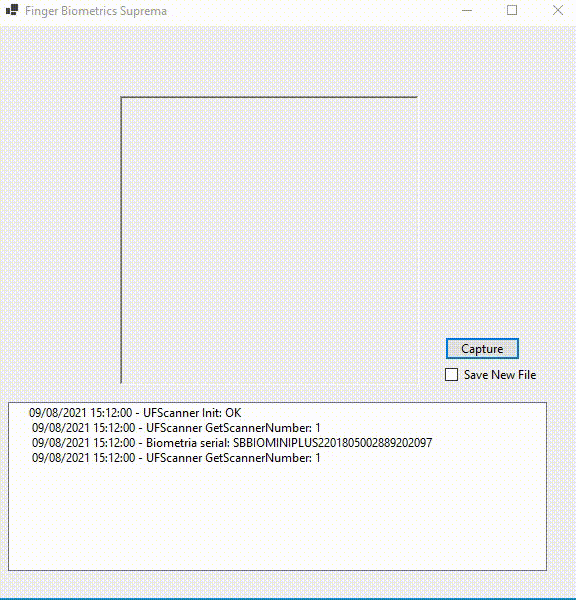

# finger-biometrics-suprema

Projeto Windows Forms "scaffolding" para utilização do SDK Suprema (gratuito) com leitores biométricos do modelo [BioMini](https://www.suprema-id.com/pt/contents/detail.php?code=010107) com .Net Core 3.1

## Pré-requisitos

* Scanner (hardware) compatível com o SDK, [BioMini](https://www.suprema-id.com/pt/contents/detail.php?code=010107)
* SDK Suprema link mantido pelo [Grupo Abion/Neoyama](https://drive.google.com/file/d/1I8Gg5RFjyDdOouqaW7Jx4GGFWN55X38A/view?usp=sharing)
* Driver do leitor biométrico (depende do modelo e do sistema operacional)
* Runtime ou SDK .Net [superior ou igual a 3.1](https://dotnet.microsoft.com/download)

## Funcionalidades

* Coleta biométrica exibindo "foto do dedo"
* Opção para armazenar captura em arquivo separado, formato wsq
* Extração da captura para formato base64

## Orientações

O presente projeto não necessita instalação do SDK da Suprema, uma vez que a referência às dlls `Suprema.UFMatcher` e `Suprema.UFScanner` é feita dentro do prórprio projeto.

É necessário que as dlls `UFMatcher` e `UFScanner`, localizadas [aqui](finger-biometrics-suprema/Resources), estejam dentro da pasta da build do projeto, adicione-as manualmente antes de rodar a solução (o path pode mudar dependendo da configuração escolhida no meu projeto é neste local finger-biometrics-suprema\obj\Debug\netcoreapp3.1)

## Como rodar

* cd finger-biometrics-suprema\
* dotnet run

## Como publicar

* cd finger-biometrics-suprema\
* dotnet publish -c Release -o dist --self-contained true -r win10-x64 /p:PublishSingleFile=true

ou pelo script PowerShell

* build.ps1

## Informações sobre o SDK Suprema

* As 4 dlls utilizadas neste projeto e o link do SDK são da versão 3.9.1
* Instalando o SDK obtém-se um projeto com muito mais funcionalidades que este, porém com .Net Framework.
* Há um manual documentando e mantido pelo fabricante sobre o uso das dlls disponível [aqui](resources/BioMiniSDK_for_Windows_3.9.1_Reference_Manual.pdf)
